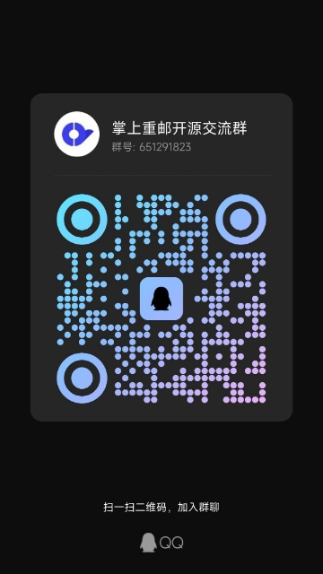

# CyxbsMobile_Android

## 如何编译
- 请先查看必看文档中的多模块教程，熟悉多模块开发规范
- 对 `module_main` 模块进行单模块编译
  - ⚠️注：`module_app` 模块只用于打正式包，因为包含密钥等文件，所以只能由副站持有

## 必看文档
- [多模块教程](https://github.com/VegetableChicken-Group/WanAndroid_Multi/blob/framework/doce/%E5%A4%9A%E6%A8%A1%E5%9D%97%E6%8C%87%E5%8D%97.md): 包含 api、lib、module 模块相关问题，还有多模块使用规范、多模块通信、单模块调试等教程
- [Android 开发中的易错点收集(内部文档)](https://redrock.feishu.cn/wiki/wikcnSDEtcCJzyWXSsfQGqWxqGe): 包含 Fragment、ViewModel、协程相关易错点收集
- [入手掌邮(内部文档)](https://redrock.feishu.cn/wiki/wikcnHCgHJSFgn5ccJ8BqjMGFef): 掌邮内部一些开发工具
- [掌邮 Android 新人接锅指南(内部文档)](https://redrock.feishu.cn/wiki/wikcn90MLIPKsG006YTLzg60fvb)

## 群聊
欢迎各位 Android 爱好者加群

