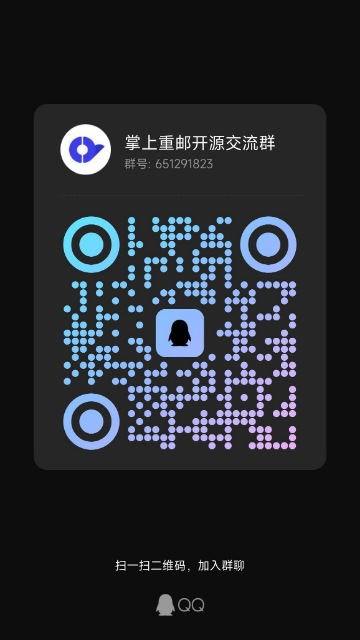

# CyxbsMobile

掌上重邮——重庆邮电大学首款整合校园与生活的App

本项目正迁移至 Compose Multiplatform 框架，目前支持如下:

| 平台      | 功能   | 状态                                                            |
|---------|------|---------------------------------------------------------------|
| Android | 功能完善 | 部分页面使用 Compose                                                |
| iOS     | 功能完善 | 主页及课表等核心页面已完成 Compose 迁移                                      |
| 桌面版     | 仅课表  | 暂无发版计划                                                        |
| 网页版     | 仅课表  | 暂无发版计划 [🔗体验链接](https://redrockmobile.github.io/CyxbsMobile/) |

## 如何编译

若需编译多平台请先安装 Kotlin Multiplatform 插件

| 平台      |                                                                 |
|---------|-----------------------------------------------------------------|
| Android | Android Studio 运行 `cyxbs-applications:test` 模块                  |
| iOS     | 安装 Kotlin Multiplatform 插件后运行 `CyxbsMobile2019_iOS` 配置          |
| 桌面版     | 安装 Kotlin Multiplatform 插件后运行 `cyxbs-applications [desktop]` 配置 |
| 网页版     | 安装 Kotlin Multiplatform 插件后运行 `cyxbs-applications [wasmJs]` 配置  |

⚠️注:

- Android 中 `cyxbs-applications:pro` 模块只用于打正式包并发版，需要密钥等文件，由每届副站或部长持有
- iOS 中若需体验完整项目，请使用 XCode
  运行 [cyxbs-applications/pro/iosApp](cyxbs-applications/pro/iosApp)
- `CyxbsMobile2019_iOS` 配置需要在 .idea/xcode.xml 中取消注释，指向为 pro/iosApp 才能被 Android Studio 正确识别

## 必看文档

- [多模块教程](https://github.com/VegetableChicken-Group/WanAndroid_Multi/blob/framework/doce/%E5%A4%9A%E6%A8%A1%E5%9D%97%E6%8C%87%E5%8D%97.md):
  包含 api、lib、module 模块相关问题，还有多模块使用规范、多模块通信、单模块调试等教程
- [Android 开发中的易错点收集(内部文档)](https://redrock.feishu.cn/wiki/wikcnSDEtcCJzyWXSsfQGqWxqGe):
  包含 Fragment、ViewModel、协程相关易错点收集
- [入手掌邮(内部文档)](https://redrock.feishu.cn/wiki/wikcnHCgHJSFgn5ccJ8BqjMGFef): 掌邮内部一些开发工具
- [掌邮 Android 新人接锅指南(内部文档)](https://redrock.feishu.cn/wiki/wikcn90MLIPKsG006YTLzg60fvb)

## 发版相关

发布新版本流程请遵循该[流程(内部文档)](https://redrock.feishu.cn/wiki/wikcnWGkmdTjWUQlrhHvBsqGsCf)

## 群聊

欢迎各位 Android 爱好者加群

